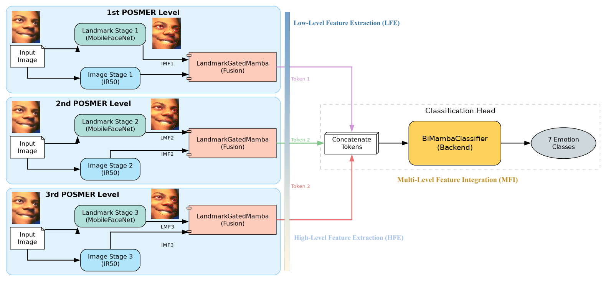

# POSMER: A Parameter-Efficient Pyramid Mamba Fusion Network for Facial Expression Recognition 



Facial Expression Recognition (FER) is pivotal for advancing human-computer interaction, yet current state-of-the-art methods like POSTER V2 face scalability limitations due to the quadratic complexity ($O(N^2)$) of their Transformer-based attention mechanisms. 
To address this bottleneck, we propose **POSMER** (Pyramid Mamba Fusion Model). 
POSMER retains the robust landmark-guided strategy of POSTER V2 but fundamentally redesigns the architecture for efficiency by replacing the window-based cross-attention with a **Landmark-Gated Mamba** mechanism and utilizing a **Bidirectional Mamba (Vim)** backend. 
This approach achieves linear complexity ($O(N)$) while effectively capturing global context through selective state space scanning. 
Furthermore, we employ Sharpness-Aware Minimization (SAM) to improve generalization. 
Experiments on the RAF-DB dataset show that POSMER surpasses the reproduced POSTER V2 baseline, achieving **92.05% Top-1 Accuracy** and **86.77% Macro-F1**, while simultaneously improving parameter efficiency by approximately **17%** (reducing the model size to **48M** parameters compared to the baseline's 58M).
### Preparation
- Preparing Data

  Download the val dataset from [kaggle](https://www.kaggle.com/datasets/shuvoalok/raf-db-dataset).
  
  As an example, assume we wish to run RAF-DB. We need to make sure it have a structure like following:

	```
	- data/raf-db/
		 train/
		     train_00001_aligned.jpg
		     train_00002_aligned.jpg
		     ...
		 valid/
		     test_0001_aligned.jpg
		     test_0002_aligned.jpg
		     ...
	```

- Preparing Pretrained Models
  
	The following table provides the pre-trained checkpoints used in this paper. Put entire `pretrain` folder under `models` folder.

	<table><tbody>
	<!-- START TABLE -->
	<!-- TABLE HEADER -->
	<th valign="bottom">pre-trained checkpoint</th>
	<th valign="bottom">baidu disk</th>
	<th valign="bottom">codes</th>
	<th valign="bottom">google drive</th>
	<!-- TABLE BODY -->
	<tr><td align="left">ir50</td>
	<td align="center"><a href="https://pan.baidu.com/s/131P9WRQfppUtsrXv8M9RQg">download</a></td>
	<th valign="bottom">(POST)</th>
  	<td align="center"><a href="https://drive.google.com/file/d/17QAIPlpZUwkQzOTNiu-gUFLTqAxS-qHt/view?usp=sharing">download</a></td>
	</tr>
	<tr><td align="left">mobilefacenet</td>
	<td align="center"><a href="https://pan.baidu.com/s/1UPO8nYkr77AsJpMkyrt2ig">download</a></td>
	<th valign="bottom">(POST)</th>
  	<td align="center"><a href="https://drive.google.com/file/d/1SMYP5NDkmDE3eLlciN7Z4px-bvFEuHEX/view?usp=sharing">download</a></td>
	</tbody></table>

### Checkpoints
The following table provides POSTER V2 checkpoints in each dataset.

<table><tbody>
<!-- START TABLE -->
<!-- TABLE HEADER -->
<th valign="bottom">dataset</th>
<th valign="bottom">top-1 acc</th>
<th valign="bottom">codes</th>
<th valign="bottom">google drive</th>
<!-- TABLE BODY -->
<tr><td align="left">RAF-DB</td>
<th valign="bottom">92.05</th>
<th valign="bottom">(POST)</th>
<td align="center">TO BE PLACED</td>
</tbody></table>


### Test

TO BE WRITTEN


### Train
TO BE WRITTEN


## License

Our research code is released under the MIT license. See [LICENSE](LICENSE) for details. 


## Acknowledgements & Inspiration

This project is deeply inspired by the research presented in **POSTER++** (also known as POSTER V2). Our work builds directly upon their insights regarding two-stream pyramid architectures and landmark-guided feature extraction. We gratefully acknowledge the authors for their significant contributions to the field of Facial Expression Recognition and for providing the baseline upon which POSMER is constructed.

If you find this project or our comparisons helpful, please consider citing the original POSTER++ paper:

```bibtex
@article{mao2025poster++,
  title={Poster++: A simpler and stronger facial expression recognition network},
  author={Mao, Jiawei and Xu, Rui and Yin, Xuesong and Chang, Yuanqi and Nie, Binling and Huang, Aibin and Wang, Yigang},
  journal={Pattern Recognition},
  volume={157},
  pages={110951},
  year={2025},
  publisher={Elsevier}
}

